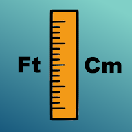
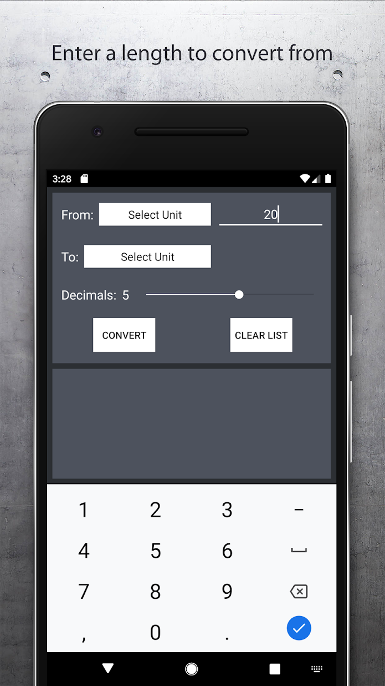
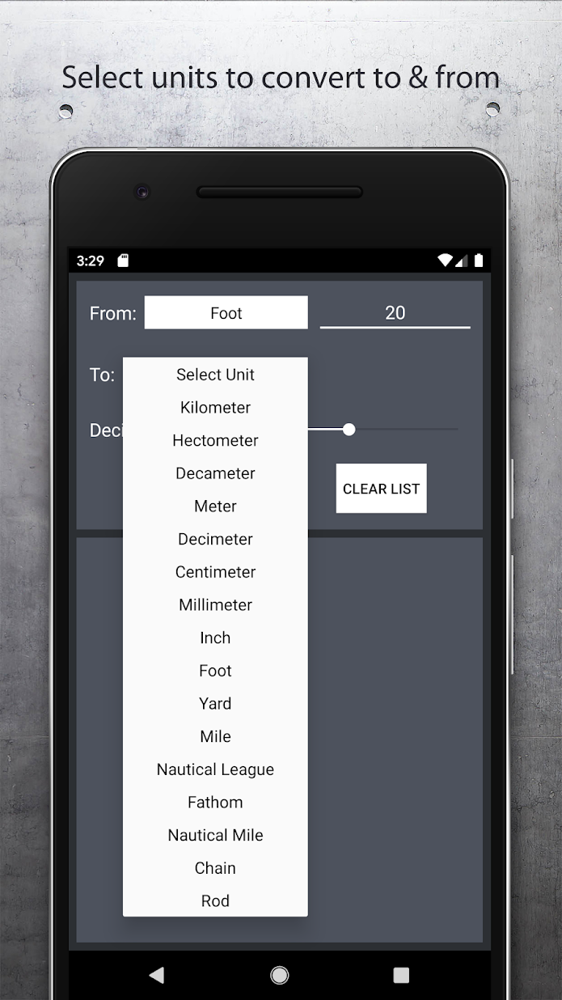
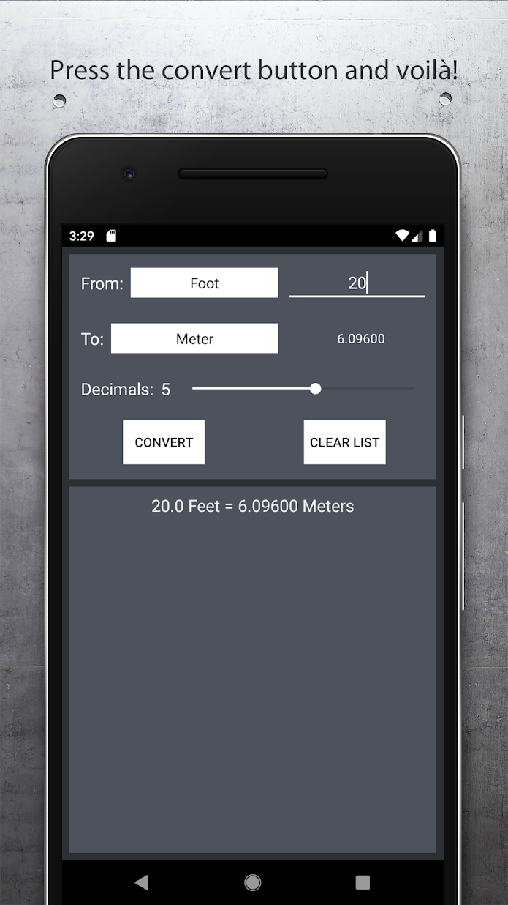
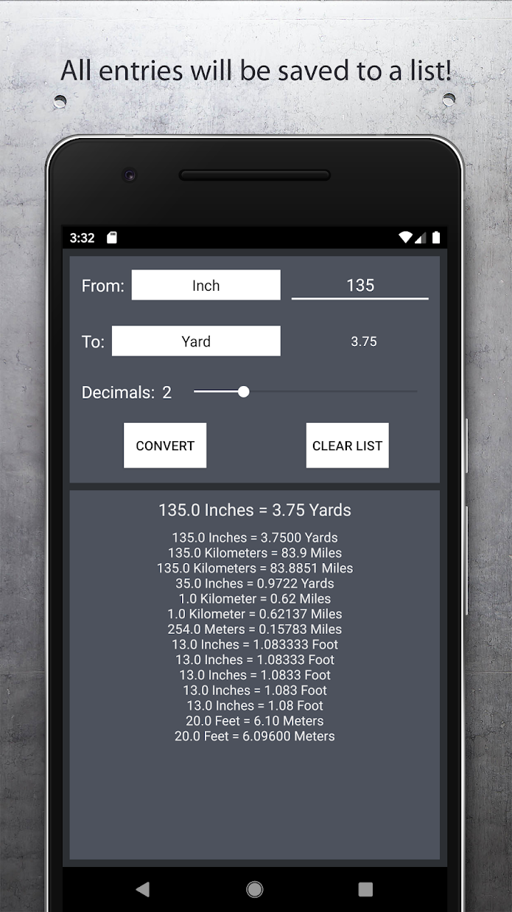

# Length-Converter-Mobile-App
A mobile app for android devices that allows people to convert a specified amount of length to different unit of length. 

# How to use
1. Download the app on the google play store here: https://play.google.com/store/apps/details?id=com.brandon.lengthconverter

2. Enter a length to convert from at the top right. 

3. Select a unit to convert to and from.

4. Press the convert button for results. 

5. You can change the amount of decimals the result has by using the slider. 

6. Every calculation will be saved to a list at the bottom. The list can be cleared by hitting the "clear list" button.

# How to get the app
There is only one version of the length converter app: a free version. It is available on the google play store.
  - free version https://play.google.com/store/apps/details?id=com.brandon.lengthconverter
